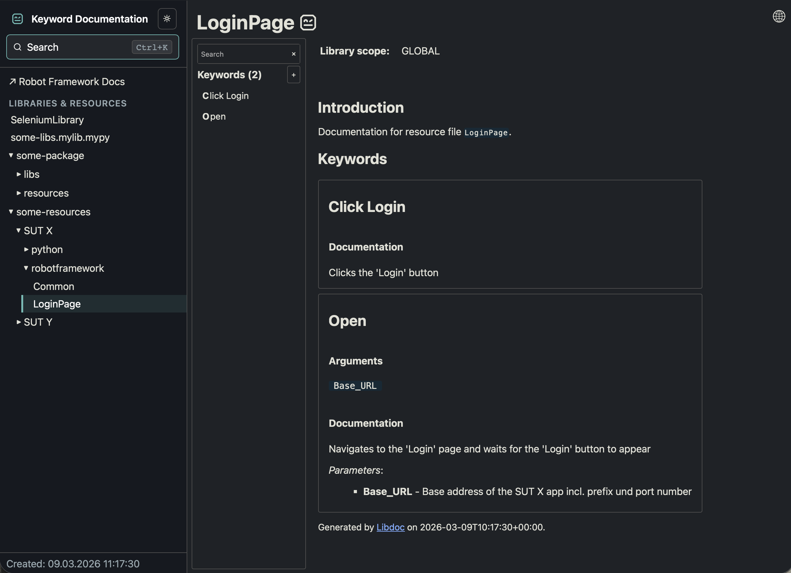

## Robot Framework LibTOC

## What it does
This tool generates docs using Robot Framework [Libdoc](https://robotframework.org/robotframework/latest/RobotFrameworkUserGuide.html#libdoc) for an entire folder with Robot Framework resources/libs and creates a TOC (table of contents) file for them

## Why use it
The Robot Framework Libdoc tool normally generates a HTML file for a single keyword library or a resource file.
If you have several keyword libraries, you just get several separate HTML files.

This tool collects separate keyword documentation files in one place and creates a TOC (table of contents) page
with links to these files.   
The result is a folder with several static HTML pages which can be placed somewhere 
in the intranet or uploaded as CI artifact - so everybody can easily access the keywords docs.

### Here is the example screenshot


## How it works
- The tool goes through the specified folder with RF resources and it's **direct** subfolders
- It looks for the **config files** named `.libtoc` which contain items you would like to create docs for:
    1. Paths to resource files in [glob format](https://en.wikipedia.org/wiki/Glob_(programming))
    2. Installed RF libraries - names and necessary import params like described in [libdoc user guide](https://robotframework.org/robotframework/latest/RobotFrameworkUserGuide.html#general-usage)
        > Other libdoc CLI options (e.g. version or name of the output file) are not supported
- Then it generates the docs using `libdoc` - both for files paths, resolved from the glob patterns, and for the installed libraries. The created HTML files are placed in the **libtoc output_dir** - keeping the original subfolder structure of resources
- Finally it generates a **TOC (Table of Contents)** HTML page with links to all the generated HTML files.
 The navigation tree structure in the TOC repeats the folder tree structure.
## Example of a `.libtoc` config file
```
[paths]
# Use glob patterns
**/*.robot
**/*.resource
**/*.py

[libs]
# Use RF library names with params - like for libdoc
SeleniumLibrary
Remote::http://10.0.0.42:8270
# You can use environment variables in lib params
SomeLib::$some_env_var/somepath
```
> The config file must contain at least one of the sections - `[paths]`, `[libs]` or both
## How to install it
### System requirements
- Python >=3.7
- Robot Framework
### Installation using pip
```shell
pip install robotframework-libtoc
```

## How to use it
- Create the `.libtoc` config files in the *root of the resources folder* and/or in *direct subfolders* where you need docs to be created.    
- Run `libtoc`. The last `resources_dir` parameter is mandatory, others are optional:
    - `-d, --output_dir`
    - `--config_file`
    - `--toc_file`
    - `--toc_template`
    - `--homepage_template`
    - `-P, --pythonpath`

    Examples:
    ```shell
    libtoc example_resources
    libtoc --output_dir docs example_resources
    libtoc --output_dir docs --toc_file MY_SPECIAL_NAME_FOR_DOCS.html example_resources
    libtoc --toc_template MY_CUSTOM_TOC.html --homepage_template MY_CUSTOM_HOMEPAGE.html example_resources
    ```

- Open the created file, e.g. `docs\keyword_docs.html`

## How to change the TOC and the homepage HTML templates
The default HTML template files are located in the python installation directory (usually something like `<python_dir>\lib\site-packages\robotframework_libtoc`) and can be changed if necessary.   
It's also possible to provide custom HTML template files using the `--toc_template` and `--homepage_template` options.

## How to set the Python Path
There are two ways to extend the list of paths where the libraries are searched for:
1. Using the `--pythonpath` option
2. Set the **PYTHONPATH** environment variable

See more in [Robot Framework User Guide](http://robotframework.org/robotframework/latest/RobotFrameworkUserGuide.html#pythonpath).
