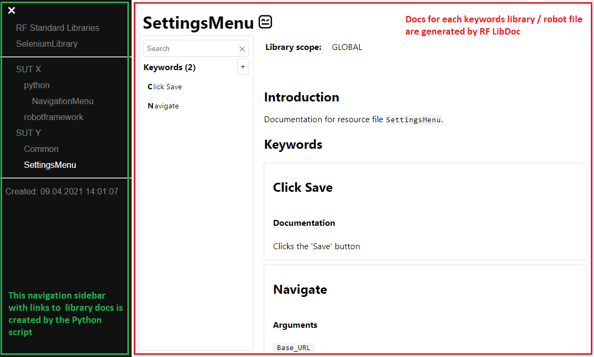

# !!!!!!!!!!!!!!!!!!!!!!!!!!!!!!!
# UPDATE ME
# !!!!!!!!!!!!!!!!!!!!!!!!!!
# RF Keyword Docs TOC

## What it does
The RobotFramework LibDoc tool generates a HTML file for a keyword library or a robot file.   
If you have several keyword libraries, you just get several separate HTML files.

This examples shows how to collect separate keyword documentation files in one place
and create a TOC (Table of content) page with links to these files.   
The result is a folder with several static HTML pages which can be placed somewhere 
in the intranet or uploaded as CI artifact - so everybody can easily access the keywords docs.

### Here is the example screenshot

## How to try it
- Install Python and RobotFramework
- Clone or download the repository
- Run the `libtoc` script in the root - it's an entry point
- Open the created file `docs\Keyword Library Docs.html`

## How it works
- The example keywords are stored in several .robot and .py files and structured in some nested folders.   
- The root script `generateDocs.bat` goes through all direct subfolders:
    - If there is a script named `generateDocs.bat` inside, it will be launched
    - The expected result is a subfolder named `docs` with keyword docs files in HTML format
    - These HTML files are copied into a new `docs` folder in the root - keeping the subfolder structure
- The Python script `create_toc.py` creates a TOC (navigation sidebar) with links to every file
- Finally the start page `Keyword Library Docs.html` is created

## How to adapt it to my project
- The root script `generateDocs.bat` only expects subfolders with child `generateDocs.bat` 
scripts directly inside - further folder sctructure doesn't matter. So you don't need to change it unless you need another sctructure.
- You would most likely need to change the child `generateDocs.bat`scripts in subfolders - 
each script differs in how it connects to the keyword libraries and creates the docs.   
    - For example, if you need to create docs for a remote library, you would need to start the remote server here.
    - You might also want to adjust the libdoc calls here, e.g. add a library docs version